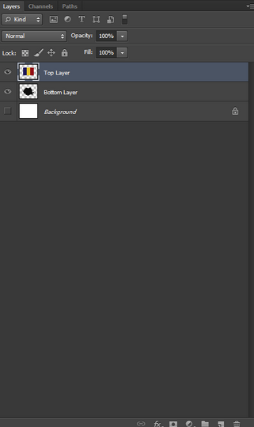
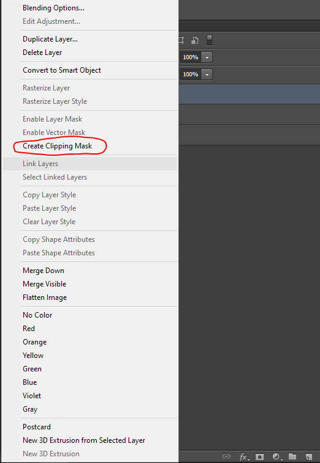
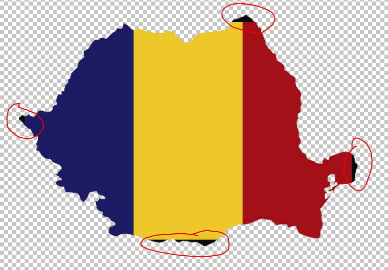
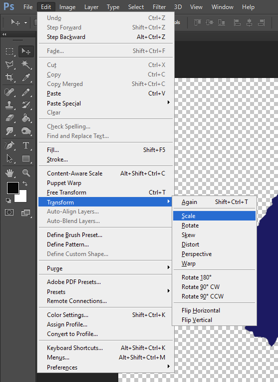
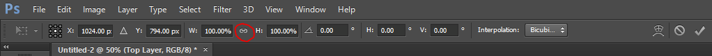
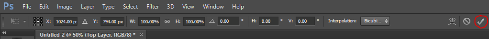
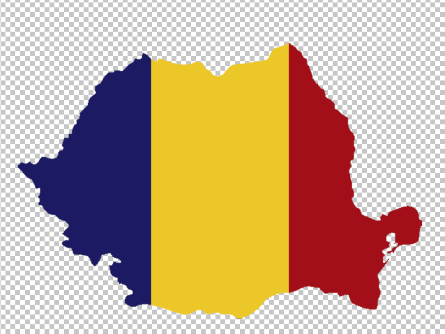

<h1>Cropping an Image to the Shape of Different Image Using a Clipping Mask in Adobe Photoshop</h1>

This guide assumes that the reader already has a file created and their two images downloaded.

<h2>Step 1 — Properly Insert the Two Chosen Images</h2>

<ul>
  <li>Click on File > Place.</li>
  <li>Find where your images are located.</li>
  <li>Select and insert the images.</li>
</ul>

<h2>Step 2 — Ensure the Images are Arranged</h2>

The image you want to crop (Top Layer) should be directly above the layer you want to crop it over (Bottom Layer), as seen in the figure below.

Figure 1. Layers tab. (Source: Joshua Rivera)

<ul>
  <li>If the layers are in the wrong order, drag the layers in the layer tab to organize them properly.</li>
</ul>

<h2>Step 3 — Applying the Clipping Mask</h2>

<ul>
  <li>Right click on the Top Layer</li>
  <li>In the pop-up menu, select “Create Clipping Mask”</li>
</ul>

Figure 2. Layer settings pop-up menu. (Source: Joshua Rivera)

<h2>Step 4 — Adjustments</h2>

Although you have successfully applied the crop, chances are you will need to align the layers. The below figure shows the Top Layer (flag) not fully covering the Bottom Layer (Country Silhouette)

Figure 3. Top Layer (flag) positioned over Bottom Layer (country silhouette) in the canvas, red circles highlight areas not covered by the Top Layer. (Source: Joshua Rivera)

<ul>
  <li>Select the Top Layer in the Layers tab.</li>
  <li>On the taskbar, click on Edit > Transform > Scale</li>
</ul>

Figure 4. Edit dropdown menu. (Source: Joshua Rivera)

<ul>
  <li>Click on the link icon between the width and height percentages.</li>
</ul>

Figure 5. Transform settings bar with link circled. (Source: Joshua Rivera)

The Top Layer should have a box around it, with squares at each corner and in the middle of each side. 
<ul>
  <li>Drag the corners of the box to resize the Top Layer.</li>
  <li>Drag inside the box to move the Top Layer around.</li>
  <li>Press the checkmark once the Bottom Layer is fully covered by the Top Layer.</li>
</ul>

Figure 6. Transform settings bar with checkmark circled. (Source: Joshua Rivera)

<h2>End of Instructions</h2>

Figure 7. Flag cropped and centered over the country silhouette. (Source: Joshua Rivera)

Now that you have completed the adjustments, you will have successfully cropped an image onto the shape of another image. If this is part of a larger project involving other layers, you can put both the Top and Bottom layer into their own dedicated group/folder, to ensure that misalignment does not occur as well as reducing the chance of accidentally separating the layers. You could also select the two layers and “rasterize” them, although this is a more permanent change that does not allow future alignment adjustment.
